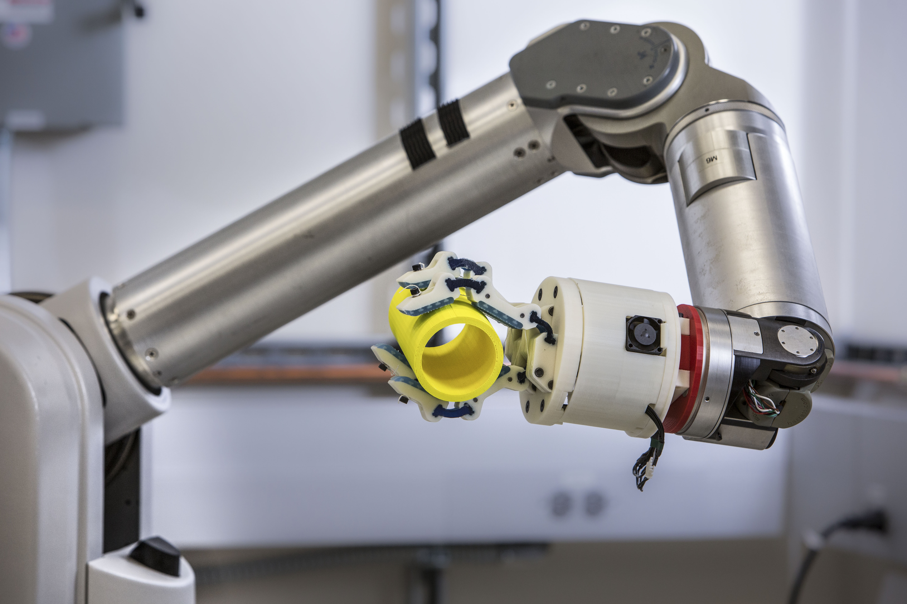

Yale OpenHand Project - Hardware
=======

CAD files for the various OpenHand hardware designs. Complete documentation, including assembly directions, can be found on the [OpenHand website](http://www.eng.yale.edu/grablab/openhand/). Control code for the most widely used hands (Model T, Model T42, Model O), with addition to a ROS node, can be found on our [openhand_node](https://github.com/grablab/openhand_node) page. For simply printing a certain hand model, navigate to the folder of the same name, and all the parts can be found in the .stl folder. For modifying the SolidWorks files, all hand-specific parts and assemblies are located inside of the hand’s folder (with exception of the M2 and VF, which share the same base as the T42). Additional parts can be found within /fingers, /couplings, or /common parts. 

All hands follow the same naming conventions with exception of Model Q. A basic dictionary of part names follows: 
a*_handName: Larger pieces used for structure. Ordered from top of the hand to the bottom. 
b*_handName: Smaller gear or servo attachment pieces. 
c*_handName: Finger mounts.
d*_handName: Optional pieces.

Most of the hand designs come with multiple finger options, each using a combination of flexure and pivot joints. Flexure joints are created with Smooth-On urethane rubber either using cut-away thin wall molds or multi-part, reusable molds. Details on Hybrid Deposition Manufacturing to create flexure joints and finger pads can be found [here](https://www.eng.yale.edu/grablab/openhand/hdm.html). 

Things to note:
- Most Solidworks parts have dependencies on other parts. To avoid warnings/errors when opening assemblies, be sure to have "Load referenced documents" set to "All" in Options>>External References
- Many of the assemblies use Configurations extensively to cut down on the number of CAD source files I have to maintain. Be sure to check them out!
- More details about our approach to CAD for this project can be found in our [CAD Guide](http://www.eng.yale.edu/grablab/openhand/OpenHand%20CAD%20Guide.pdf)

### Model T
Based on the original SDM Hand [[1]](https://www.eng.yale.edu/grablab/pubs/Dollar_IJRR2010.pdf), the Model T is the OpenHand Project's first released hand design. The four underactuated fingers are differentially coupled through a floating pulley tree, allowing for equal force output on all finger contacts. Due to the limitation of having only one actuator, this hand lacks in-hand manipulation capabilities, but excels in tasks requiring adaptable gripping with limited actuation [[2]](https://www.eng.yale.edu/grablab/pubs/Ma_RAM2017.pdf), [[3]](https://www.eng.yale.edu/grablab/pubs/Ma_ICRA2013.pdf)

### Model T42
The Model T42 is a two-finger, two-actuator hand designed for more dexterous planar tasks. It is still capable of underactuated, adaptive grasping, but the additional actuator makes it capable of some in-hand manipulation primitives as well as precision grasping, e.g. [[4]](https://www.eng.yale.edu/grablab/pubs/Calli_TASE2018.pdf), [[5]](https://www.eng.yale.edu/grablab/pubs/Sintov_RAL2019.pdf). 

### Model M2
The Model M2, short for Multi-Modality Gripper, is a minimalist gripper with a single underactuated finger and a library of modular thumb designs. Each thumb design can enable a different grasping behavior and allows for faster, more versatile design iterations. The distinct agonist and antagonist tendons allow for both underactuated and fully-actuated grasps of objects. By sacrificing the full-actuation capabilities of the M2, the Model M functions otherwise identically with only one actuator [[6]](https://www.eng.yale.edu/grablab/pubs/Ma_REMAR2015_1.pdf).

### Model VF
The Model VF, short for Variable Friction Gripper, is similar to the T42 with the addition of changing finger pad surfaces. The additional actuator within each finger allows the hand to change surface friction during manipulation. By swapping the Constant and Variable Friction fingers, the hand can translate and rotate objects in a controlled manner [[7]](http://berkcalli.com/publications/2018-SpiersCalliDollar.pdf).

### Model O
The Model O is a three-finger, four-actuator hand designed to replicate the capabilities of commercial hands such as [BarrettHand](http://www.barrett.com/robot/products-hand.htm), RightHand Robotics' [Reflex Hand](http://www.righthandrobotics.com/main:reflex), and Robotiq's 3-Finger Adaptive Gripper. Each underactuated finger is independently controlled, while a fourth actuator controls the adduction/abduction angle between two of the fingers. This allows the hand to transition between spherical-grasping and power-grasping configurations [[8]](https://www.eng.yale.edu/grablab/pubs/Odhner_IJRR2014.pdf).

### Stewart Hand
The Stewart hand is a dexterous hand designed for 6-DOF within-hand manipulation. Its non-anthropomorphic design draws inspiration from the Stewart-Gough platform parallel mechanism. This simple kinematic structure allows for straightforward, accurate control with minimal sensing [[9]](https://www.eng.yale.edu/grablab/pubs/McCann_RAM2021.pdf).

### Model Q
The Model Q is a four-finger, four-actuator hand similar in actuation elements to the Model O, but vastly different in capabilities. The two independently-actuated precision-grasp fingers allow for pinching similar to the Model T42’s capabilities. A pair of power-grasping fingers are controlled by a single actuator, while also being rotated with respect to the precision-grasping fingers by a fourth actuator. This setup enables in-hand finger-gaiting by trading control of the manipulated object between the two pairs of fingers while rotating the power-grasping set. Using its two independent sets of fingers, the hand can also manipulate an in-hand object closer to its palm for a tighter power grasp [[9]](https://www.eng.yale.edu/grablab/pubs/Ma_ROBIO2014.pdf).

